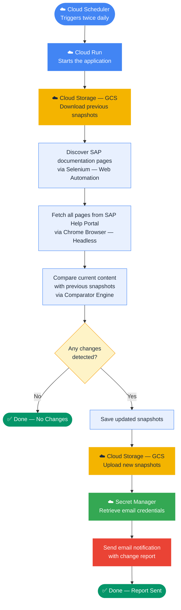
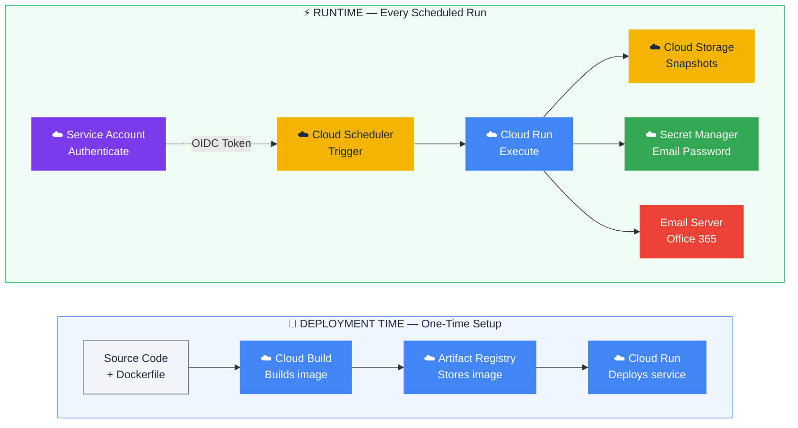

# SAP Doc Monitor — Complete GCP Workflow Guide

## Table of Contents

1. [GCP Services Used & Their Purpose](#1-gcp-services-used--their-purpose)
2. [One-Time Deployment Workflow (Step-by-Step)](#2-one-time-deployment-workflow-step-by-step)
3. [Runtime Workflow (When Cloud Scheduler Fires)](#3-runtime-workflow-when-cloud-scheduler-fires)
4. [Visual Diagrams](#4-visual-diagrams)

---

## 1. GCP Services Used & Their Purpose

| # | GCP Service | Purpose in This Project | Used During |
|---|-------------|------------------------|-------------|
| 1 | **Cloud Build** | Builds the Docker image from the Dockerfile on Google's servers | Deployment only |
| 2 | **Artifact Registry / Container Registry** | Stores the built Docker image (`gcr.io/{PROJECT_ID}/sap-doc-monitor`) | Deployment (image storage for Cloud Run) |
| 3 | **Cloud Run** | Runs the containerized Python app (Flask HTTP server) that performs the actual monitoring | Deployment + Runtime |
| 4 | **Cloud Storage (GCS)** | Persistently stores document snapshots (`.txt` files) between runs — because Cloud Run containers are **ephemeral** (destroyed after each run) | Runtime only |
| 5 | **Secret Manager** | Securely stores the email SMTP password (`email-password`). Cloud Run injects it as the `EMAIL_PASSWORD` environment variable at runtime | Runtime only |
| 6 | **Service Account** (`sap-monitor-scheduler`) | An identity that gives Cloud Scheduler permission to invoke the **private** (unauthenticated access blocked) Cloud Run service using OIDC tokens | Runtime only |
| 7 | **Cloud Scheduler** | The **trigger** — sends an HTTP POST request to Cloud Run on a cron schedule (twice daily at 9 AM and 6 PM) to start the monitoring job | Runtime only |

### Key Clarification

> **GCS, Secret Manager, Service Account, and Cloud Scheduler are NOT part of the Docker build/push/deploy process.**
> They are **runtime infrastructure** — they exist so the app can function correctly every time Cloud Run executes it.

---

## 2. One-Time Deployment Workflow (Step-by-Step)

Below is the **exact sequence** from the deployment script. Each step must complete before the next one starts.

---

### Step 1: Configure gcloud CLI

Sets your GCP project and region so all subsequent commands target the correct project.

---

### Step 2: Enable Required GCP APIs

Activates 5 GCP APIs — Cloud Run, Cloud Build, Cloud Storage, Cloud Scheduler, and Secret Manager. Without this, none of the services can be used.

---

### Step 3: Create Cloud Storage (GCS) Bucket

Creates a GCS bucket for persistent snapshot storage.

- Cloud Run containers are **ephemeral** — files are destroyed when the container shuts down.
- GCS provides **persistent storage** that survives across container restarts.
- **Before each run:** Previous snapshots are **downloaded** from GCS (the "last known state").
- **After each run:** Updated snapshots are **uploaded** back to GCS for the next comparison cycle.
- Grants the Cloud Run service account read/write/delete access to the bucket.

---

### Step 4: Create Secret in Secret Manager

Stores the email SMTP password securely in Secret Manager.

- Avoids hardcoding passwords in code or environment variables.
- Secret Manager encrypts and securely stores the password.
- Cloud Run injects it as an environment variable at runtime.
- Grants the service account permission to access the secret.

---

### Step 5: Build Docker Image (Cloud Build)

Builds the application Docker image on Google's servers using Cloud Build.

- Source code is uploaded to Cloud Build.
- Cloud Build reads the Dockerfile and builds the image (Python, Chrome, application code).
- The built image is automatically stored in **Artifact Registry / Container Registry**.

---

### Step 6: Deploy to Cloud Run

Deploys the Docker image as a managed Cloud Run service.

- Only authenticated requests can invoke the service (public access is blocked).
- Allocates sufficient resources for running the browser-based scraper.
- Injects email configuration and documentation URL as environment variables.
- Mounts the Secret Manager secret as an environment variable.
- Returns a **Service URL** that Cloud Scheduler will use to trigger runs.

---

### Step 7: Create Service Account for Cloud Scheduler

Creates a dedicated service account for Cloud Scheduler.

- Cloud Run is deployed as **private** (no public access).
- Cloud Scheduler needs an authenticated identity to call Cloud Run.
- This service account is granted the **Cloud Run Invoker** role.
- Cloud Scheduler uses it to generate authentication tokens for each request.

---

### Step 8: Create Cloud Scheduler Job

Creates a scheduled job that triggers the monitoring automatically.

- Runs on a **daily schedule** at 9:00 AM and 6:00 PM.
- Sends an authenticated HTTP request to the Cloud Run service URL.
- Uses the service account created in Step 7 for authentication.
- This is what makes the entire system fully automated.

---

### Step 9: Test the Deployment

Manually triggers the scheduler job to verify the full pipeline works end-to-end.

---

## 3. Runtime Workflow (When Cloud Scheduler Fires)

Every time Cloud Scheduler triggers (daily at 9 AM and 6 PM, or manually), here is the **exact sequence of events**:

---

### Stage 1: Cloud Scheduler → Cloud Run (THE TRIGGER)

```
Cloud Scheduler fires at 9:00 AM or 6:00 PM
    │
    ├── Generates an OIDC token (signed as sap-monitor-scheduler service account)
    ├── Sends HTTP POST to Cloud Run service URL
    │
    ▼
Cloud Run receives the authenticated HTTP POST request
    │
    ├── Verifies OIDC token → authenticated ✓
    ├── Spins up a fresh container (cold start if no warm instance)
    ├── Flask app (cloud_run_app.py) handles request at route '/'
    ├── Calls main.main() — starts the monitoring logic
    │
    ▼
```

---

### Stage 2: Download Previous Snapshots from GCS

```
main.main() starts
    │
    ├── Checks: is GCS_BUCKET_NAME env var set? (is_gcs_enabled())
    │
    ├── YES → GCS Mode (Cloud Run):
    │   ├── Wipes any local .txt snapshots baked into the Docker image
    │   ├── Downloads ALL previous .txt snapshot files from GCS bucket
    │   │   (gs://{PROJECT_ID}-sap-snapshots/snapshots/*.txt)
    │   └── These represent the "last known state" of each SAP doc page
    │
    ├── NO → Local Mode (development):
    │   └── Uses snapshots already in the local snapshots/ directory
    │
    ▼
```

**Why this stage exists:**
Cloud Run containers are ephemeral — every container starts fresh with no memory of previous runs. GCS acts as the "persistent memory" between runs.

---

### Stage 3: Discover & Fetch SAP Documentation Pages

```
    │
    ├── Auto-discovers all documentation page URLs from SAP Help TOC
    │   (Uses Selenium + headless Chrome to load the TOC page)
    │
    ├── For each discovered page:
    │   ├── Fetches the full HTML content (headless Chrome)
    │   ├── Extracts text content from HTML (parser/parse_content.py)
    │   └── Validates content (rejects pages with < 100 chars — likely rendering failures)
    │
    ▼
```

---

### Stage 4: Compare Current vs. Previous Content

```
    │
    ├── For each page:
    │   ├── If NO previous snapshot exists → marks as NEW PAGE
    │   ├── If previous snapshot exists → compares old text vs. new text
    │   │   ├── Detects additions (new lines)
    │   │   ├── Detects removals (deleted lines)
    │   │   ├── Detects structural warnings
    │   │   └── Validates: blocks suspicious changes (>70% shrinkage = rendering failure)
    │   └── Collects all changes into a report
    │
    ▼
```

---

### Stage 5: Save Updated Snapshots & Upload to GCS

```
    │
    ├── Saves updated/new snapshots to local filesystem inside container
    │
    ├── If GCS is enabled:
    │   ├── Uploads ALL local snapshots to GCS bucket
    │   └── Deletes stale GCS files that no longer exist locally (sync)
    │
    ▼
```

**Why this stage exists:**
The updated snapshots must be persisted to GCS so the **next** run (at 6 PM the same day, or 9 AM the next day) can download them and compare again.

---

### Stage 6: Send Email Notification (Secret Manager provides password)

```
    │
    ├── Builds email notification (HTML + plain text) with:
    │   ├── Summary of changes detected (or "no changes")
    │   ├── Details of additions/removals per page
    │   └── Links to changed pages
    │
    ├── Reads EMAIL_PASSWORD from environment variable
    │   (injected by Secret Manager via Cloud Run's --update-secrets)
    │
    ├── Connects to SMTP server (smtp.office365.com:587)
    ├── Sends email to configured recipients
    │
    ▼
```

---

### Stage 7: Cloud Run Returns Response

```
    │
    ├── Returns HTTP 200 (success) or HTTP 500 (error) to Cloud Scheduler
    ├── Container may be kept warm briefly or shut down
    │
    ▼ DONE
```

---

## 4. Visual Diagrams

### Deployment Flow (One-Time Setup)


### Runtime Flow (Every Scheduled Run)



### Complete GCP Services Interaction Map



---

## Summary: Why Each Service Exists

| Service | One-Line Purpose |
|---------|-----------------|
| **Cloud Build** | Builds the Docker image from source code on Google's servers (replaces local `docker build` + `docker push`) |
| **Artifact Registry** | Stores the built Docker image so Cloud Run can pull it |
| **Cloud Run** | Runs the containerized Flask app that performs the monitoring logic |
| **GCS Bucket** | Persistent storage for snapshots — because Cloud Run containers are destroyed after each run and lose all local files |
| **Secret Manager** | Securely stores the email password — injected into Cloud Run as an env var at runtime |
| **Service Account** | Gives Cloud Scheduler an authenticated identity to call the private (no public access) Cloud Run endpoint |
| **Cloud Scheduler** | The automated trigger — sends HTTP POST to Cloud Run on a cron schedule (9 AM & 6 PM daily) so the monitoring runs automatically twice a day |

> **Bottom line:** Cloud Build + Artifact Registry + Cloud Run = **Deployment chain**. GCS + Secret Manager + Service Account + Cloud Scheduler = **Runtime infrastructure** that makes the app work automatically and securely every day.
