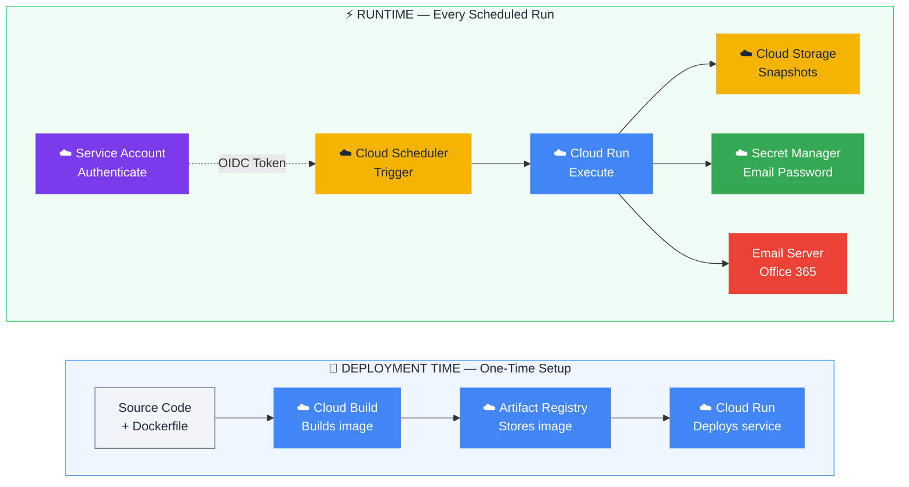

# SAP Doc Monitor — Complete GCP Workflow Guide

## Table of Contents

1. [GCP Services Used & Their Purpose](#1-gcp-services-used--their-purpose)
2. [One-Time Deployment Workflow (Step-by-Step)](#2-one-time-deployment-workflow-step-by-step)
3. [Runtime Workflow (When Cloud Scheduler Fires)](#3-runtime-workflow-when-cloud-scheduler-fires)
4. [Visual Diagrams](#4-visual-diagrams)

---

## 1. GCP Services Used & Their Purpose

| # | GCP Service | Purpose in This Project | Used During |
|---|-------------|------------------------|-------------|
| 1 | **Cloud Build** | Builds the Docker image from the Dockerfile on Google's servers | Deployment only |
| 2 | **Artifact Registry / Container Registry** | Stores the built Docker image (`gcr.io/{PROJECT_ID}/sap-doc-monitor`) | Deployment (image storage for Cloud Run) |
| 3 | **Cloud Run** | Runs the containerized Python app (Flask HTTP server) that performs the actual monitoring | Deployment + Runtime |
| 4 | **Cloud Storage (GCS)** | Persistently stores document snapshots (`.txt` files) between runs — because Cloud Run containers are **ephemeral** (destroyed after each run) | Runtime only |
| 5 | **Secret Manager** | Securely stores the email SMTP password (`email-password`). Cloud Run injects it as the `EMAIL_PASSWORD` environment variable at runtime | Runtime only |
| 6 | **Service Account** (`sap-monitor-scheduler`) | An identity that gives Cloud Scheduler permission to invoke the **private** (unauthenticated access blocked) Cloud Run service using OIDC tokens | Runtime only |
| 7 | **Cloud Scheduler** | The **trigger** — sends an HTTP POST request to Cloud Run on a cron schedule (twice daily at 9 AM and 6 PM) to start the monitoring job | Runtime only |

### Key Clarification

> **GCS, Secret Manager, Service Account, and Cloud Scheduler are NOT part of the Docker build/push/deploy process.**
> They are **runtime infrastructure** — they exist so the app can function correctly every time Cloud Run executes it.

---

## 2. One-Time Deployment Workflow (Step-by-Step)

Below is the **exact sequence** from the deployment script. Each step must complete before the next one starts.

---

### Step 1: Configure gcloud CLI

```bash
gcloud config set project {PROJECT_ID}
gcloud config set run/region us-central1
```

**What happens:** Sets your GCP project and region so all subsequent commands target the correct project.

---

### Step 2: Enable Required GCP APIs

```bash
gcloud services enable \
    run.googleapis.com \
    cloudscheduler.googleapis.com \
    cloudbuild.googleapis.com \
    storage.googleapis.com \
    secretmanager.googleapis.com
```

**What happens:** Activates 5 GCP APIs. Without this, none of the services can be used.

| API | Enables |
|-----|---------|
| `run.googleapis.com` | Cloud Run |
| `cloudscheduler.googleapis.com` | Cloud Scheduler |
| `cloudbuild.googleapis.com` | Cloud Build |
| `storage.googleapis.com` | Cloud Storage (GCS) |
| `secretmanager.googleapis.com` | Secret Manager |

---

### Step 3: Create Cloud Storage (GCS) Bucket

```bash
gsutil mb -p {PROJECT_ID} -l us-central1 gs://{PROJECT_ID}-sap-snapshots
```

**What happens:** Creates a GCS bucket named `{PROJECT_ID}-sap-snapshots`.

**Why this is needed:**
- Cloud Run containers are **ephemeral** — all files inside them are destroyed when the container shuts down.
- The app needs to compare **current** page content with **previous** snapshots to detect changes.
- GCS provides **persistent storage** that survives across container restarts.
- **Before each run:** All previous snapshot `.txt` files are **downloaded** from GCS into the container's local `snapshots/` directory. These downloaded snapshots represent the "last known state" of each SAP documentation page. The app then fetches the **live** content from SAP Help, extracts text, and compares it line-by-line against the downloaded snapshot for each page. If differences are found (additions, removals, or structural changes), those are flagged as changes.
- **After each run:** The updated snapshots (with the latest content) are **uploaded** back to GCS, so the **next** scheduled run can download them and repeat the comparison cycle.

Also grants the App Engine default service account `objectAdmin` permission on the bucket:
```bash
gsutil iam ch serviceAccount:{PROJECT_ID}@appspot.gserviceaccount.com:objectAdmin gs://{BUCKET_NAME}
```

**Why this permission is needed:**
- Cloud Run runs your container under the **App Engine default service account** (`{PROJECT_ID}@appspot.gserviceaccount.com`).
- The app code calls GCS APIs to download and upload snapshot files (`blob.download_to_filename()`, `blob.upload_from_filename()`, `blob.delete()`).
- These API calls are authenticated as whatever service account Cloud Run is running under.
- Without `objectAdmin` on the bucket, these calls would fail with **403 Permission Denied**.
- `objectAdmin` grants full read/write/delete access to objects in the bucket — exactly what the app needs to download old snapshots, upload updated ones, and delete stale ones.

---

### Step 4: Create Secret in Secret Manager

```bash
echo -n "{EMAIL_PASSWORD}" | gcloud secrets create email-password \
    --data-file=- --replication-policy="automatic"
```

**What happens:** Stores the email SMTP password as a secret named `email-password` in Secret Manager.

**Why this is needed:**
- The app sends email notifications via SMTP (Office 365).
- Hardcoding passwords in code or environment variables is insecure.
- Secret Manager encrypts and securely stores the password.
- Cloud Run mounts it at runtime as the `EMAIL_PASSWORD` environment variable (via `--update-secrets` flag during deploy).

Also grants the service account permission to access the secret:
```bash
gcloud secrets add-iam-policy-binding email-password \
    --member="serviceAccount:{PROJECT_ID}@appspot.gserviceaccount.com" \
    --role="roles/secretmanager.secretAccessor"
```

---

### Step 5: Build Docker Image (Cloud Build)

```bash
gcloud builds submit --tag gcr.io/{PROJECT_ID}/sap-doc-monitor
```

**What happens (inside Google Cloud):**
1. Your local source code (Dockerfile + `sap-doc-monitor/` folder) is uploaded to Cloud Build.
2. Cloud Build reads the `Dockerfile` and builds the image:
   - Starts from `python:3.11-slim`
   - Installs Chrome browser + Selenium dependencies
   - Installs Python packages from `requirements.txt`
   - Copies application code
   - Replaces `settings.py` with `settings.cloud.py` (reads from env vars instead of hardcoded values)
   - Sets the entrypoint to `python cloud_run_app.py` (Flask HTTP server)
3. The built image is automatically **pushed** to **Container Registry** at `gcr.io/{PROJECT_ID}/sap-doc-monitor`.

> **This is the "build & push" step you already know.** Cloud Build does both in a single command — you don't need to run `docker build` and `docker push` separately.

---

### Step 6: Deploy to Cloud Run

```bash
gcloud run deploy sap-doc-monitor \
    --image gcr.io/{PROJECT_ID}/sap-doc-monitor \
    --platform managed \
    --region us-central1 \
    --no-allow-unauthenticated \
    --memory 2Gi \
    --cpu 2 \
    --timeout 900 \
    --max-instances 1 \
    --set-env-vars EMAIL_SENDER="..." \
    --set-env-vars EMAIL_RECEIVER="..." \
    --set-env-vars SMTP_SERVER="..." \
    --set-env-vars SMTP_PORT="587" \
    --set-env-vars BASE_DOCUMENTATION_URL="..." \
    --set-env-vars SNAPSHOTS_DIR="/app/snapshots" \
    --update-secrets EMAIL_PASSWORD=email-password:latest
```

**What happens:**
1. Cloud Run pulls the Docker image from Container Registry.
2. Creates a managed Cloud Run **service** named `sap-doc-monitor`.
3. Configures it with:
   - **`--no-allow-unauthenticated`** — Only authenticated requests (with valid OIDC tokens) can invoke the service. Public access is blocked.
   - **`--memory 2Gi --cpu 2`** — Sufficient resources for running headless Chrome.
   - **`--timeout 900`** — 15-minute max execution time (scraping all pages takes time).
   - **`--max-instances 1`** — Only one container runs at a time (prevents duplicate runs).
   - **`--set-env-vars`** — Injects email config and doc URL as environment variables.
   - **`--update-secrets EMAIL_PASSWORD=email-password:latest`** — Mounts the Secret Manager secret as the `EMAIL_PASSWORD` env var.
4. Returns a **Service URL** (e.g., `https://sap-doc-monitor-xxxxx-uc.a.run.app`).

> The Flask app (`cloud_run_app.py`) listens on port 8080. When it receives a POST request at `/`, it calls `main.main()` which runs the full monitoring workflow.

---

### Step 7: Create Service Account for Cloud Scheduler

```bash
gcloud iam service-accounts create sap-monitor-scheduler \
    --display-name "SAP Monitor Scheduler"
```

Then grant it permission to invoke the Cloud Run service:
```bash
gcloud run services add-iam-policy-binding sap-doc-monitor \
    --member="serviceAccount:sap-monitor-scheduler@{PROJECT_ID}.iam.gserviceaccount.com" \
    --role="roles/run.invoker" \
    --region=us-central1
```

**Why this is needed:**
- In Step 6, the Cloud Run service was deployed with `--no-allow-unauthenticated` (private).
- Cloud Scheduler needs an **identity** to authenticate its requests to Cloud Run.
- This service account has the `roles/run.invoker` role, which allows it to call the Cloud Run service.
- Cloud Scheduler uses this service account to generate **OIDC tokens** attached to each HTTP request.

---

### Step 8: Create Cloud Scheduler Job

```bash
gcloud scheduler jobs create http sap-doc-monitor-job \
    --location=us-central1 \
    --schedule="0 9,18 * * *" \
    --uri={CLOUD_RUN_SERVICE_URL} \
    --http-method=POST \
    --oidc-service-account-email=sap-monitor-scheduler@{PROJECT_ID}.iam.gserviceaccount.com \
    --oidc-token-audience={CLOUD_RUN_SERVICE_URL} \
    --time-zone="America/New_York"
```

**What happens:** Creates a Cloud Scheduler job that:
- Runs on a **cron schedule** (`0 9,18 * * *` = every day at 9:00 AM and 6:00 PM).
- Sends an **HTTP POST** to the Cloud Run service URL.
- Authenticates using **OIDC token** signed as the `sap-monitor-scheduler` service account.

> **This is the trigger that makes the entire system automated.** Without Cloud Scheduler, you would have to manually call the Cloud Run URL every time.

---

### Step 9: Test the Deployment

```bash
gcloud scheduler jobs run sap-doc-monitor-job --location=us-central1
```

**What happens:** Manually triggers the scheduler job to verify the full pipeline works end-to-end.

---

## 3. Runtime Workflow (When Cloud Scheduler Fires)

Every time Cloud Scheduler triggers (daily at 9 AM and 6 PM, or manually), here is the **exact sequence of events**:

---

### Stage 1: Cloud Scheduler → Cloud Run (THE TRIGGER)

```
Cloud Scheduler fires at 9:00 AM or 6:00 PM
    │
    ├── Generates an OIDC token (signed as sap-monitor-scheduler service account)
    ├── Sends HTTP POST to Cloud Run service URL
    │
    ▼
Cloud Run receives the authenticated HTTP POST request
    │
    ├── Verifies OIDC token → authenticated ✓
    ├── Spins up a fresh container (cold start if no warm instance)
    ├── Flask app (cloud_run_app.py) handles request at route '/'
    ├── Calls main.main() — starts the monitoring logic
    │
    ▼
```

---

### Stage 2: Download Previous Snapshots from GCS

```
main.main() starts
    │
    ├── Checks: is GCS_BUCKET_NAME env var set? (is_gcs_enabled())
    │
    ├── YES → GCS Mode (Cloud Run):
    │   ├── Wipes any local .txt snapshots baked into the Docker image
    │   ├── Downloads ALL previous .txt snapshot files from GCS bucket
    │   │   (gs://{PROJECT_ID}-sap-snapshots/snapshots/*.txt)
    │   └── These represent the "last known state" of each SAP doc page
    │
    ├── NO → Local Mode (development):
    │   └── Uses snapshots already in the local snapshots/ directory
    │
    ▼
```

**Why this stage exists:**
Cloud Run containers are ephemeral — every container starts fresh with no memory of previous runs. GCS acts as the "persistent memory" between runs.

---

### Stage 3: Discover & Fetch SAP Documentation Pages

```
    │
    ├── Auto-discovers all documentation page URLs from SAP Help TOC
    │   (Uses Selenium + headless Chrome to load the TOC page)
    │
    ├── For each discovered page:
    │   ├── Fetches the full HTML content (headless Chrome)
    │   ├── Extracts text content from HTML (parser/parse_content.py)
    │   └── Validates content (rejects pages with < 100 chars — likely rendering failures)
    │
    ▼
```

---

### Stage 4: Compare Current vs. Previous Content

```
    │
    ├── For each page:
    │   ├── If NO previous snapshot exists → marks as NEW PAGE
    │   ├── If previous snapshot exists → compares old text vs. new text
    │   │   ├── Detects additions (new lines)
    │   │   ├── Detects removals (deleted lines)
    │   │   ├── Detects structural warnings
    │   │   └── Validates: blocks suspicious changes (>70% shrinkage = rendering failure)
    │   └── Collects all changes into a report
    │
    ▼
```

---

### Stage 5: Save Updated Snapshots & Upload to GCS

```
    │
    ├── Saves updated/new snapshots to local filesystem inside container
    │
    ├── If GCS is enabled:
    │   ├── Uploads ALL local snapshots to GCS bucket
    │   └── Deletes stale GCS files that no longer exist locally (sync)
    │
    ▼
```

**Why this stage exists:**
The updated snapshots must be persisted to GCS so the **next** run (at 6 PM the same day, or 9 AM the next day) can download them and compare again.

---

### Stage 6: Send Email Notification (Secret Manager provides password)

```
    │
    ├── Builds email notification (HTML + plain text) with:
    │   ├── Summary of changes detected (or "no changes")
    │   ├── Details of additions/removals per page
    │   └── Links to changed pages
    │
    ├── Reads EMAIL_PASSWORD from environment variable
    │   (injected by Secret Manager via Cloud Run's --update-secrets)
    │
    ├── Connects to SMTP server (smtp.office365.com:587)
    ├── Sends email to configured recipients
    │
    ▼
```

---

### Stage 7: Cloud Run Returns Response

```
    │
    ├── Returns HTTP 200 (success) or HTTP 500 (error) to Cloud Scheduler
    ├── Container may be kept warm briefly or shut down
    │
    ▼ DONE
```

---

## 4. Visual Diagrams

### Deployment Flow (One-Time Setup)

```mermaid
flowchart TD
    Start(["🚀 Start Deployment"])
    Start --> S1

    S1["Step 1 — Configure gcloud CLI\nSet project & region"]
    S1 --> S2

    S2["Step 2 — Enable GCP APIs\nCloud Run, Cloud Build, GCS,\nSecret Manager, Cloud Scheduler"]
    S2 --> S3

    S3["Step 3 — Create GCS Bucket\nPersistent snapshot storage"]
    S3 --> S4

    S4["Step 4 — Create Secret\nStore email password\nin Secret Manager"]
    S4 --> S5

    S5["Step 5 — Cloud Build\nBuild Docker image\nfrom source code"]
    S5 --> S5a

    S5a["Artifact Registry\nStores built Docker image"]
    S5a --> S6

    S6["Step 6 — Deploy to Cloud Run\nPulls image from registry\nMounts secret as env var\nConnects to GCS bucket"]
    S6 --> S7

    S7["Step 7 — Create Service Account\nsap-monitor-scheduler\nGrant Cloud Run invoker role"]
    S7 --> S8

    S8["Step 8 — Create Cloud Scheduler\nCron: 9 AM & 6 PM daily\nPoints to Cloud Run URL\nUses Service Account for auth"]
    S8 --> S9

    S9["Step 9 — Test Run\nManually trigger scheduler"]
    S9 --> Done(["✅ Deployment Complete"])

    style Start fill:#059669,color:#fff,stroke:none
    style Done fill:#059669,color:#fff,stroke:none
    style S1 fill:#EFF6FF,stroke:#3B82F6,color:#1E293B
    style S2 fill:#EFF6FF,stroke:#3B82F6,color:#1E293B
    style S3 fill:#FFF7ED,stroke:#F97316,color:#1E293B
    style S4 fill:#F0FDF4,stroke:#22C55E,color:#1E293B
    style S5 fill:#EDE9FE,stroke:#7C3AED,color:#1E293B
    style S5a fill:#EDE9FE,stroke:#7C3AED,color:#1E293B
    style S6 fill:#DBEAFE,stroke:#2563EB,color:#1E293B
    style S7 fill:#FEF3C7,stroke:#F59E0B,color:#1E293B
    style S8 fill:#FEF3C7,stroke:#F59E0B,color:#1E293B
    style S9 fill:#FCE7F3,stroke:#EC4899,color:#1E293B
```



### Runtime Flow (Every Scheduled Run)


### Complete GCP Services Interaction Map



---

## Summary: Why Each Service Exists

| Service | One-Line Purpose |
|---------|-----------------|
| **Cloud Build** | Builds the Docker image from source code on Google's servers (replaces local `docker build` + `docker push`) |
| **Artifact Registry** | Stores the built Docker image so Cloud Run can pull it |
| **Cloud Run** | Runs the containerized Flask app that performs the monitoring logic |
| **GCS Bucket** | Persistent storage for snapshots — because Cloud Run containers are destroyed after each run and lose all local files |
| **Secret Manager** | Securely stores the email password — injected into Cloud Run as an env var at runtime |
| **Service Account** | Gives Cloud Scheduler an authenticated identity to call the private (no public access) Cloud Run endpoint |
| **Cloud Scheduler** | The automated trigger — sends HTTP POST to Cloud Run on a cron schedule (9 AM & 6 PM daily) so the monitoring runs automatically twice a day |

> **Bottom line:** Cloud Build + Artifact Registry + Cloud Run = **Deployment chain**. GCS + Secret Manager + Service Account + Cloud Scheduler = **Runtime infrastructure** that makes the app work automatically and securely every day.
