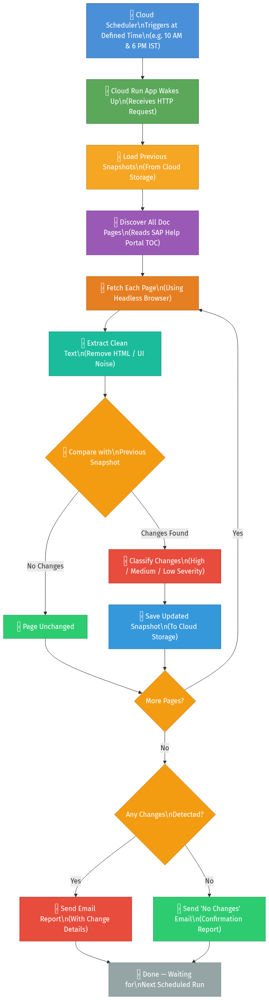

# SAP Doc Monitor — Project Overview

## What Is This Project?

**SAP Doc Monitor** is an automated tool that watches SAP documentation pages for any changes and sends you an email whenever something is updated, added, or removed. Think of it as a "watchdog" that checks SAP Help Portal pages on your behalf so you never miss an important update.

---

## Why Was It Built?

SAP updates its documentation pages without any prior announcement. Manually checking 25+ pages multiple times a day is not practical. This tool automates that entire process — you just sit back and get notified.

---

## How It Works — Simple Flowchart



### Step-by-Step Summary

| Step | What Happens |
|------|-------------|
| **1. Trigger** | Google Cloud Scheduler sends a request at the scheduled time (e.g., 10 AM & 6 PM IST) |
| **2. App Wakes Up** | The Cloud Run app receives the request and starts the monitoring process |
| **3. Load Previous Data** | Downloads previously saved page snapshots from Cloud Storage |
| **4. Discover Pages** | Reads the SAP Help Portal Table of Contents to find all documentation pages |
| **5. Fetch Pages** | Opens each page using a headless browser (needed because SAP pages use JavaScript) |
| **6. Extract Text** | Strips away all HTML and UI clutter — keeps only the actual documentation text |
| **7. Compare** | Checks the current text against the previously saved version |
| **8. Classify Changes** | If changes are found, labels them as High, Medium, or Low severity |
| **9. Save Updated Data** | Stores the new version of changed pages for the next comparison |
| **10. Send Email** | Sends a professional email report — either listing all changes or confirming "No Changes" |
| **11. Done** | App goes back to sleep until the next scheduled trigger |

---

## Key Capabilities

- **Automatic Page Discovery** — Give it one URL, it finds all related pages automatically
- **Smart Change Detection** — Ignores cosmetic differences (formatting, bullet styles), only flags real content changes
- **Severity Levels** — Changes are classified as HIGH (critical instruction changes), MEDIUM (content updates), or LOW (minor tweaks)
- **New & Removed Page Detection** — Alerts you when pages are added to or removed from SAP documentation
- **Safety Checks** — Won't overwrite saved data if a page fails to load properly
- **Email Reports** — Clean, professional HTML emails with full change breakdown

---

## Where Does It Run?

| Component | Purpose |
|-----------|---------|
| **Google Cloud Run** | Runs the monitoring app (only when triggered — no idle cost) |
| **Google Cloud Scheduler** | Triggers the app at defined times (e.g., twice daily) |
| **Google Cloud Storage** | Stores page snapshots between runs |
| **Email (SMTP)** | Sends notification emails via Office 365 or Gmail |

### How Cloud Scheduler Triggers the App

The app exposes an HTTP endpoint using **Flask** (a lightweight Python web framework). Google Cloud Scheduler sends an HTTP request to this endpoint at the configured schedule (e.g., 10 AM & 6 PM IST). When Cloud Run receives the request, the Flask app invokes the full monitoring pipeline — fetch, compare, and notify. The app is containerized using **Docker** with **Python 3.11** and runs only when triggered, so there is no idle cost.

---

## Technologies Used

| Technology | Role |
|------------|------|
| **Python 3.11** | Core programming language |
| **Flask** | Lightweight web framework — exposes the HTTP endpoint that Cloud Scheduler triggers |
| **Selenium + Google Chrome** | Headless browser to render JavaScript-heavy SAP documentation pages |
| **BeautifulSoup4** | HTML parsing and text extraction |
| **Google Cloud Storage SDK** | Read/write page snapshots to Cloud Storage |
| **Docker** | Containerization for consistent deployment to Cloud Run |
| **Google Cloud Scheduler** | Cron-based HTTP trigger to start each monitoring run |
| **Google Cloud Run** | Serverless container execution (scales to zero when idle) |

---

## Project Structure (Simplified)

```
SAP Doc Monitor/
├── sap-doc-monitor/
│   ├── main.py              ← Main script that runs the full workflow
│   ├── cloud_run_app.py     ← HTTP wrapper for Cloud Run triggers
│   ├── fetcher/             ← Fetches SAP documentation pages
│   ├── parser/              ← Extracts clean text from HTML
│   ├── comparator/          ← Compares current vs previous content
│   ├── notifier/            ← Sends email notifications
│   ├── storage/             ← Handles Cloud Storage operations
│   ├── config/              ← Settings and configuration
│   └── snapshots/           ← Saved page snapshots (local mode)
├── Dockerfile               ← Container setup for deployment
└── docs/                    ← Diagrams and documentation
```

---

## In a Nutshell

> **Cloud Scheduler triggers the app → App fetches SAP docs → Compares with saved versions → Emails you the changes → Waits for the next run.**

That's it. Fully automated, no manual effort needed.
